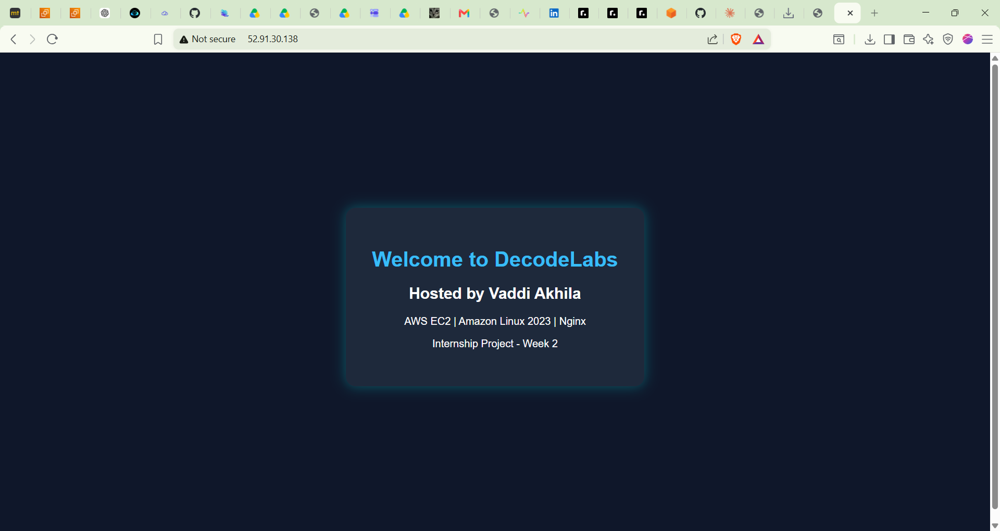

# 🖥️ EC2 Web Server Deployment — DecodeLabs Internship Week 2

> Acting as a SysAdmin to provision a virtual server in the cloud, install a web server, and host a custom webpage — all without touching physical hardware.


---

## 🌐 Live Demo

🔗 **[http://52.91.30.138](http://52.91.30.138)**

> ⚠️ Note: EC2 instance must be running to access the live link.

---

## 📸 Screenshot



---

## 🎯 Mission

A startup needed a dedicated server environment with full control over the OS to install custom software and security patches.

**As a SysAdmin, the tasks were to:**
- Launch a Virtual Machine (EC2) using Linux
- Connect to the server securely using SSH
- Install a Web Server (Nginx) via the command line
- Host a custom "Welcome to DecodeLabs" webpage

---

## 🛠️ Technologies Used

| Technology | Purpose |
|---|---|
| AWS EC2 | Virtual server in the cloud |
| Amazon Linux 2023 | Operating System |
| Nginx | Web Server |
| SSH | Secure remote connection |
| HTML & CSS | Custom webpage |

---

## 📋 Step-by-Step Process

### Step 1 — Launch EC2 Instance
- Logged into **AWS Console**
- Navigated to **EC2 → Launch Instance**
- Selected **Amazon Linux 2023** as the OS
- Chose **t3.micro** instance type (free tier)
- Created and downloaded **decode-labs_Key.pem** key pair
- Configured **Security Group** with:
  - Port **22** (SSH) for secure connection
  - Port **80** (HTTP) for web traffic

### Step 2 — Connect via SSH
```bash
ssh -i "decode-labs_Key.pem" ec2-user@52.91.30.138
```

### Step 3 — Update the Server
```bash
sudo yum update -y
```

### Step 4 — Install Nginx
```bash
sudo yum install nginx -y
```

### Step 5 — Start Nginx
```bash
sudo systemctl start nginx
sudo systemctl enable nginx
```

### Step 6 — Deploy Custom Webpage
```bash
sudo nano /usr/share/nginx/html/index.html
```

### Step 7 — Verify Nginx is Running
```bash
sudo systemctl status nginx
```

### Step 8 — Access the Webpage
Opened browser and navigated to:
```
http://52.91.30.138
```

---

## 🔒 Security Group Configuration

| Type | Protocol | Port | Source |
|---|---|---|---|
| SSH | TCP | 22 | My IP |
| HTTP | TCP | 80 | 0.0.0.0/0 |

---

## 📁 Project Structure

```
EC2-WebServer-Deployment/
│
├── index.html       # Custom webpage hosted on Nginx
├── screenshot.png   # Live webpage screenshot
└── README.md        # Project documentation
```

---

## ✅ Outcome

- ✅ EC2 instance successfully launched on AWS
- ✅ Connected securely via SSH
- ✅ Nginx web server installed and running
- ✅ Custom "Welcome to DecodeLabs" webpage live
- ✅ Accessible over the internet via public IP

---

## 📬 Contact

| Platform | Link |
|---|---|
| 📧 Email | akhilavaddi03@gmail.com |
| 💼 LinkedIn | [akhila-vaddi-803085253](https://www.linkedin.com/in/akhila-vaddi-803085253/) |
| 🐙 GitHub | [Akhilavaddi9462](https://github.com/Akhilavaddi9462) |

---

<p align="center">Provisioned on AWS EC2 | DecodeLabs Internship — Week 2 ☁️</p>
